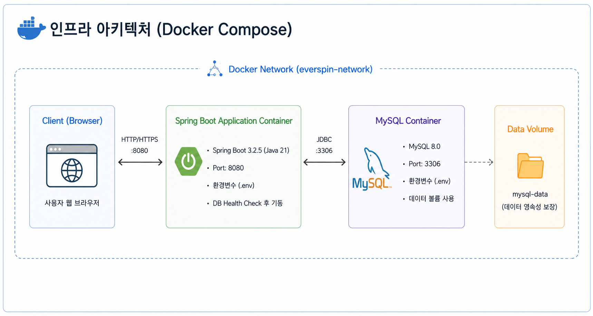
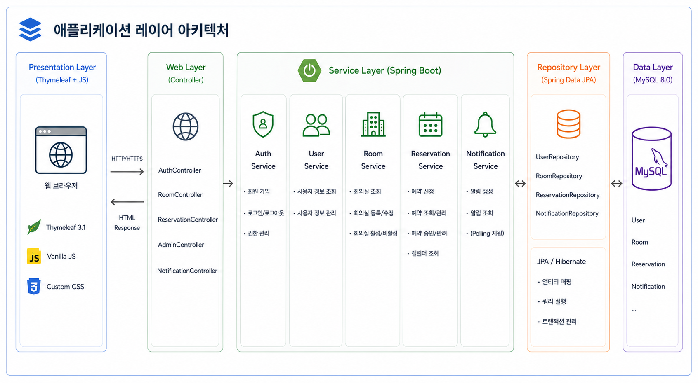

# Meet Room Reservation System

회의실 예약 및 관리 웹 애플리케이션입니다.

## 기술 스택

- **Backend**: Java 21, Spring Boot 3.2.5, Spring Security 6, Spring Data JPA
- **Frontend**: Thymeleaf 3.1, Vanilla JS, Custom CSS
- **Database**: MySQL 8.0
- **Infrastructure**: Docker, Docker Compose

---

## 실행 방법

### 사전 요구사항

- Docker, Docker Compose 설치 필요
- 8080(앱), 3306(MySQL) 포트 사용 가능 여부 확인

### 실행

```bash
docker compose up --build
```

애플리케이션이 시작되면 http://localhost:8080 에서 접근 가능합니다.

> DB 헬스체크 통과 후 앱이 기동되므로, 최초 실행 시 30초~1분 정도 소요될 수 있습니다.

### 포트 충돌 시 변경 방법

기본 포트(8080, 3306)가 이미 사용 중이라면 `docker-compose.yml`에서 **호스트 포트**(콜론 왼쪽 숫자)만 변경합니다.

```yaml
services:
  app:
    ports:
      - "9090:8080"   # 9090으로 접근 → http://localhost:9090
  db:
    ports:
      - "3307:3306"   # 호스트의 3307로 노출 (앱 내부 통신에는 영향 없음)
```

> 컨테이너 내부 포트(콜론 오른쪽)는 그대로 두어야 합니다.

### 환경 변수 설정 (필수)

보안을 위해 데이터베이스 접속 정보는 `.env` 파일로 관리해야 합니다.
애플리케이션을 실행하기 전, 프로젝트 루트 디렉토리에 `.env` 파일을 생성하고 아래와 같이 자신의 환경에 맞는 값을 설정해주세요.

```env
MYSQL_DATABASE=meetroom
MYSQL_USER=myuser
MYSQL_PASSWORD=mypassword
MYSQL_ROOT_PASSWORD=myrootpassword
```

> **기존 사용자 주의:** DB 이름이 `everspin` → `meetroom` 으로 변경되었습니다.
> MySQL 이미지는 데이터 디렉토리가 비어 있는 최초 기동 시에만 `MYSQL_DATABASE` 를 생성하므로,
> 기존 `db-data` 볼륨이 남아 있으면 `Unknown database 'meetroom'` 으로 기동에 실패합니다.
> `docker compose down -v` 로 볼륨을 삭제하거나(데이터 삭제됨),
> 데이터를 유지하려면 `RENAME`/덤프 복원으로 스키마 이름을 옮기세요.

### 초기 계정

애플리케이션 최초 실행 시 관리자 계정과 샘플 회의실이 자동으로 생성됩니다.

| 구분 | 아이디 | 비밀번호 |
|------|--------|----------|
| 관리자 | `admin` | `admin1234` |

일반 사용자는 `/auth/signup` 에서 직접 가입합니다.

### 종료 및 데이터 초기화

```bash
# 종료 (데이터 유지)
docker compose down

# 종료 + 데이터 삭제
docker compose down -v
```

---

## 주요 기능

| 기능 | 설명 |
|------|------|
| 회원가입 / 로그인 | Spring Security 폼 로그인 |
| 회의실 조회 | 전체 회의실 목록 및 상세 정보 확인 |
| 예약 신청 | 회의실 선택 후 날짜·시간·참석 인원 입력 |
| 예약 캘린더 | 월별 내 예약 현황 캘린더 뷰 |
| 예약 승인/반려 | 관리자가 대기 중인 예약을 처리 |
| 알림 | 예약 상태 변경 시 알림 표시 |
| 회의실 관리 | 관리자가 회의실 추가·활성화/비활성화 |

---

## 아키텍처

### 인프라 구조



### 애플리케이션 레이어



---

## 설계 내용 및 고민했던 부분

### 1. 예약 중복 방지 — 비관적 락(Pessimistic Lock)

동시에 같은 시간대에 예약 요청이 들어올 경우 둘 다 성공하는 문제를 방지해야 했습니다.

낙관적 락은 충돌이 발생한 뒤 예외를 던지고 재시도를 애플리케이션이 처리해야 하는 반면, 비관적 락은 `SELECT FOR UPDATE`로 DB 레벨에서 선점하여 후속 요청이 락 해제 전까지 대기합니다. 예약은 충돌 빈도가 낮고, 실패 시 재시도보다 즉각적인 오류 안내가 UX 측면에서 낫다고 판단하여 비관적 락을 선택했습니다.

```java
@Lock(LockModeType.PESSIMISTIC_WRITE)
@Query("SELECT r FROM Reservation r WHERE r.room.id = :roomId ...")
List<Reservation> findOverlappingReservationsWithLock(...);
```

### 2. 예약 승인 워크플로 — PENDING 상태 도입

예약 즉시 확정하지 않고 관리자 승인 단계를 두었습니다. 상태는 `PENDING → CONFIRMED / REJECTED`, 또는 사용자가 직접 `CANCELLED`로 전환합니다. 이미 시작된 예약은 취소할 수 없도록 시간 검증을 추가했습니다.


### 3. N+1 문제 해결 — JOIN FETCH

`Reservation`은 `User`와 `Room`을 `LAZY`로 참조합니다. 목록 화면에서 `user.name`, `room.name`에 접근할 때마다 별도 쿼리가 발생하는 N+1 문제가 있었습니다.

조회 쿼리에 `JOIN FETCH`를 적용해 단일 쿼리로 해결했으며, 페이지네이션과 함께 사용할 때는 `countQuery`를 별도로 지정해 Hibernate 경고를 방지했습니다.

```java
@Query(value = "SELECT r FROM Reservation r JOIN FETCH r.user JOIN FETCH r.room WHERE r.status = :status ...",
       countQuery = "SELECT COUNT(r) FROM Reservation r WHERE r.status = :status")
Page<Reservation> findPendingWithDetails(...);
```

### 4. 상태별 카운트 — DB GROUP BY

캘린더 우측의 활동 현황에서 상태별 건수를 보여줄 때, 초기 구현은 사용자의 전체 예약을 Java로 불러와 `stream().collect(groupingBy(...))`로 집계했습니다. 예약이 많아질수록 낭비가 커지므로 DB `GROUP BY` 쿼리로 교체했습니다.

```sql
SELECT r.status, COUNT(r) FROM Reservation r WHERE r.user.id = :userId GROUP BY r.status
```

### 5. Thymeleaf 3.1 호환성

Thymeleaf 3.1부터 보안상의 이유로 `#request`, `#session` 등의 웹 컨텍스트 객체가 표현식에서 제거되었습니다. 활성 네비게이션 항목 표시에 `${#request.requestURI}`를 사용하고 있었는데, 이를 클라이언트 사이드 JS로 대체했습니다.

```javascript
const p = window.location.pathname;
document.querySelectorAll('.nav-item[href]').forEach(el => {
  if (p.startsWith(el.getAttribute('href'))) el.classList.add('active');
});
```
